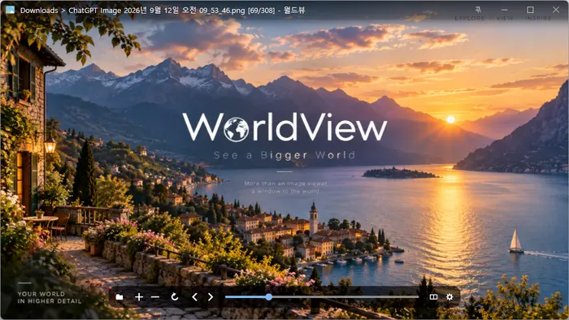

# WorldView

**Visualizador de imagens gratuito para Windows para ver imagens, arquivos compactados e documentos PDF com rapidez e conforto.**

[English](README.md) · [한국어](README.ko.md) · [简体中文](README.zh-CN.md) · [日本語](README.ja.md) · [Español](README.es.md) · Português (Brasil) · [Français](README.fr.md)

> Este documento é uma tradução. Em caso de divergência, a [versão em coreano](README.ko.md) prevalece.

-0078D4)

> O programa não tem tradução para português; ele é exibido em inglês. Os nomes de botões e menus abaixo aparecem como na tela.

## Visão geral

O WorldView permite folhear pastas cheias de fotos, ler quadrinhos compactados em página dupla sem descompactá-los e rolar webtoons como uma única tira contínua. Documentos PDF abrem do mesmo jeito, página por página.

Arraste uma imagem para a janela e ela abre na hora, com as outras imagens da mesma pasta logo em seguida. A tela mostra só a imagem; os botões aparecem apenas quando você leva o mouse à borda superior ou inferior da janela.

O desenho é feito pela placa de vídeo, então até fotos grandes são ampliadas com suavidade, e as páginas anterior e seguinte são lidas antecipadamente para que virar a página quase nunca faça esperar.

## Principais recursos

- **Vários formatos de imagem** — JPEG, PNG, GIF, WebP, TIFF, BMP, SVG, JPEG XL, HEIC, AVIF, PSD, RAW de câmera e mais.
- **Arquivos compactados sem descompactar** — Veja uma a uma as imagens dentro de arquivos ZIP, RAR, 7Z, CBZ, CBR, EGG, ALZ etc.
- **Documentos PDF** — Cada página é uma imagem; ao ampliar, a página é redesenhada nesse tamanho para o texto ficar nítido.
- **Quatro modos de exibição** — Uma página, duas páginas (esquerda→direita / direita→esquerda), primeira página como capa e webtoon contínuo.
- **Imagens animadas** — Reproduz GIF, APNG e WebP animados.
- **Rotação automática e correção de cor** — Fotos tiradas na vertical abrem de pé, e fotos com perfil de cor aparecem com as cores reais.
- **Zoom e navegador** — Amplia em torno do cursor; quando a imagem não cabe, o navegador no canto inferior direito leva você a qualquer ponto dela.
- **Informações da imagem e EXIF** — Pressione `Tab` uma vez para ver os dados do arquivo e a data da foto, a câmera, a lente e a exposição.
- **Recursos práticos** — Associações de arquivos, tela cheia, sempre visível, arquivos recentes, continuar de onde parou, excluir para a Lixeira e atalhos personalizáveis.
- **8 idiomas** — Coreano · inglês · japonês · chinês · russo · italiano · francês · espanhol.

## Download / Instalação

| Tipo | Link |
|---|---|
| Instalador | [Download](https://down.kilho.net/worldview?lang=pt) |
| Portátil (ZIP) | [Download](https://down.kilho.net/worldview?lang=pt&nosetup) |

O instalador abre o WorldView assim que a instalação termina. Na versão portátil, descompacte o ZIP e execute `WorldView.exe` — a pasta `vendor` deve ficar junto do executável. As configurações são salvas na pasta do programa, então, se você levar a versão portátil num pendrive, suas configurações vão junto.

Nenhuma das versões cria associações de arquivos sozinha. Para abrir imagens no WorldView com um clique duplo, ative-as em **Preferences → File Types** (veja "O que fazer quando…" abaixo).

## Como usar

### Primeiros passos

1. Execute o WorldView e arraste para a janela um arquivo de imagem, uma pasta, um arquivo compactado ou um PDF. Você também pode escolher um arquivo com o botão de pasta da barra inferior ou com a tecla `O`.
2. A imagem abre ajustada à janela, e as outras imagens da mesma pasta formam uma lista em ordem de nome. O título no topo mostra onde você está, por exemplo `Pasta > Nome do arquivo [69/308]`.
3. Gire a roda do mouse ou pressione `←` `→` · `PageUp` `PageDown` para ir à página anterior ou seguinte. Você também pode clicar nos botões de seta que aparecem ao levar o mouse às laterais esquerda e direita da janela.
4. Leve o mouse à borda inferior para mostrar a barra inferior. Ela tem botões de zoom, rotação e página e uma barra de navegação — arraste-a para ir direto a qualquer página.
5. Use o botão **View** à direita da barra inferior para escolher o zoom (ajustar à janela, tamanho original, largura, altura) e o modo de exibição (uma página, duas páginas, webtoon). A escolha é lembrada para a próxima página e a próxima execução.
6. Clique com o **botão direito** em qualquer parte da janela para abrir o menu: Open File, Recent Files, Show in Explorer, Delete File e Preferences.

### Organização da tela

**Barra superior** (aparece quando o mouse chega perto do topo da janela)

| Elemento | Função |
|---|---|
| Ícone do aplicativo | Abre o mesmo menu do clique com o botão direito |
| Título | Pasta > nome do arquivo [página atual/total]. `Loading` é acrescentado em páginas que demoram |
| Alfinete | Liga ou desliga **Always on top** (sempre visível) |
| Minimizar · `[]` · Fechar | `[]` alterna a tela cheia |

**Barra inferior** (aparece quando o mouse chega perto da base da janela)

| Botão | Função |
|---|---|
| Pasta | Abrir um arquivo |
| `+` · `−` | Ampliar · reduzir |
| Girar | Girar 90 graus no sentido horário |
| `‹` · `›` | Página anterior · próxima página |
| Barra de navegação | Arraste ou clique para ir a qualquer página |
| View | O menu View — zoom, duas páginas, capa, webtoon |
| Engrenagem | Preferences |

**Menu do botão direito**

| Item | Função |
|---|---|
| **Open File** · **Open Folder** | Escolher um arquivo ou uma pasta para abrir |
| **Recent Files** | Os 5 últimos itens abertos |
| **Show in Explorer** | Abre o Explorador com o arquivo atual selecionado |
| **View** | O mesmo menu do botão View da barra inferior |
| **Delete File** | Envia o arquivo atual para a Lixeira |
| **About WorldView** · **Preferences** · **Quit** | Página do programa · janela de configurações · sair |

**Preferences** — As mudanças valem na hora; não há botão `OK`. **Reset**, no canto inferior esquerdo, volta todas as configurações ao padrão e também remove as associações de arquivos.

| Página | Itens |
|---|---|
| **General** | Quit with the Esc key · Ask before deleting a file · Reopen last file at start · Always on top · Logging · Language |
| **View** | Zoom · View mode · First page as cover · Wide pages alone · Show scrollbars · EXIF in image info · Show the navigator · Show the left/right arrow buttons · At the first/last file |
| **File Types** | Extensões que abrem no WorldView com clique duplo |
| **Shortcuts** | Mudar a tecla de cada ação |

### O que fazer quando…

**Quer folhear as fotos de uma pasta**
Arraste ou dê um clique duplo numa foto e as imagens daquela pasta formam uma lista em ordem de nome. Os números são ordenados como números, então `foto2.jpg` vem antes de `foto10.jpg`. Vire as páginas com a roda · `←` `→` · `PageUp` `PageDown` · `Space`, e vá à primeira e à última com `Home` `End`.

**Quer ler um quadrinho compactado sem descompactar**
Arraste um arquivo ZIP · RAR · 7Z · CBZ · CBR do jeito que está e as imagens de dentro são viradas uma a uma. Sem descompactar e sem pasta temporária. As pastas internas do arquivo aparecem em sequência, em ordem de nome.

**Quer ler uma pasta de estante inteira**
Arraste uma pasta: o WorldView percorre todas as subpastas, abre página por página os arquivos compactados e PDFs que estão nelas e monta uma única lista. Você lê do começo ao fim sem abrir cada volume separadamente.

**Quer escolher vários itens e ver só eles**
Selecione vários arquivos, pastas ou arquivos compactados no Explorador e arraste-os juntos — só a sua seleção vira a lista. Arquivos vizinhos que você não escolheu ficam de fora.

**Quer ler quadrinhos em página dupla**
Escolha **View** → **Two Pages (Left to Right)** para mostrar duas páginas lado a lado, como um livro. Para mangás japoneses, lidos da direita para a esquerda, escolha **Two Pages (Right to Left)**. Mesmo com número ímpar de páginas, a última mantém a sua metade em vez de crescer de repente.

**A capa desalinha os pares**
Se a página 1 é uma capa e cada página dupla parece deslocada em uma página, ative **First Page as Cover**. A capa fica sozinha e depois as páginas se juntam como 2-3, 4-5 e assim por diante.

**Quadrinhos com ilustrações em página dupla**
Ative **Wide Pages Alone**: uma imagem larga, digitalizada como duas páginas, aparece sozinha e grande, enquanto as demais continuam em pares.

**Quer ler um webtoon como uma tira contínua**
Ative **View** → **Webtoon (Continuous)** e todas as páginas são unidas na vertical na largura da janela — é só continuar rolando. Arraste a barra de rolagem à direita para ir a qualquer ponto da tira inteira.

**Uma única imagem muito alta**
Uma imagem com altura maior que três vezes a largura abre ajustada à largura, **começando pelo topo**. Desça com a roda · `↑` `↓` · `Space`; chegar ao fim não pula para a próxima página, então você nunca perde o ponto de leitura. Vá para a próxima página com `PageDown` ou o botão de seta. `Ctrl`+`Home` / `Ctrl`+`End` vão direto ao topo ou ao fim daquela imagem.

**Quer ler um PDF página por página**
Arraste um PDF e cada página é virada como uma imagem. Você também pode abri-lo como um livro na exibição de duas páginas ou rolá-lo na exibição webtoon. Ao ampliar ou aumentar a janela, a página é redesenhada nesse tamanho, deixando até letras pequenas nítidas, e o fundo branco a mantém legível mesmo com tema escuro.

**Quer ampliar uma foto grande para ver os detalhes**
`Ctrl`+roda amplia e reduz **em torno do cursor**. As teclas `+` `-` e os botões inferiores também funcionam. Arraste a imagem ampliada para movê-la e use `Shift`+roda para movê-la na horizontal. Quando a imagem é maior que a janela, o **navegador** aparece no canto inferior direito, marcando com um retângulo a parte que você está vendo — clique ou arraste para ir direto até lá. Ao ampliar, o original é lido de novo, então os detalhes finos continuam nítidos.

**Quer esconder o navegador**
Passe o mouse sobre o navegador e clique no X que aparece. Para mostrá-lo de novo, ative **Preferences → View → Show the navigator**.

**Quer mudar o zoom rapidamente**
`1` ajustar à janela, `2` tamanho original, `3` ajustar à largura, `4` ajustar à altura. O zoom escolhido continua na próxima página e na próxima execução — escolha uma vez para sempre ler digitalizações largas ajustadas à largura, ou para sempre ver fotos no tamanho original.

**Quer ver os dados da foto**
Pressione `Tab` para mostrar no canto superior esquerdo o nome do arquivo · o tamanho do arquivo · a data de modificação · os dados da imagem. Se a foto tiver dados EXIF, também aparecem a data da foto · a câmera · a lente · a exposição · a distância focal · o flash · a localização (GPS), só as linhas que têm valor. Na exibição de duas páginas, cada página mostra suas informações na sua metade. Pressione `Tab` de novo para esconder.

**Quer abrir fotos do iPhone (HEIC), RAW de câmera ou arquivos do Photoshop**
HEIC · AVIF · JPEG XL, arquivos RAW da Canon · Nikon · Sony · Olympus · Pentax · Panasonic e arquivos PSD do Photoshop abrem como qualquer outra imagem ao serem arrastados. As fotos abrem na orientação em que foram tiradas, e os perfis de cor embutidos são aplicados para mostrar as cores reais.

**Quer ver GIF e WebP animados**
Abra um GIF · APNG · WebP animado na exibição de uma página e ele é reproduzido. As exibições de duas páginas e webtoon mostram só o primeiro quadro.

**Quer organizar as fotos enquanto vê**
Pressione `Delete` numa foto que você não quer; aparece uma confirmação e **Yes** a envia para a Lixeira. Ela não é apagada de vez — dá para restaurá-la pela Lixeira. Se a confirmação atrapalhar, desative **Preferences → General → Ask before deleting a file**. Funciona só com arquivos em pastas; imagens dentro de arquivos compactados não são alteradas.

**Quer continuar de onde parou**
Basta executar o WorldView e a lista e a página que você via da última vez abrem de novo; um quadrinho não terminado continua daquela página. Os 5 últimos itens abertos ficam em botão direito → **Recent Files**. Se preferir começar com a janela vazia, desative **Reopen last file at start**.

**Quer curtir em tela cheia**
Pressione `Enter` ou clique em `[]` na barra de título para uma tela cheia que cobre até a barra de tarefas. Pressione `Esc` ou `Enter` para voltar. Em tela cheia, `Esc` nunca fecha o programa — só sai da tela cheia.

**Quer deixar a janela por cima como referência**
Clique no alfinete da barra de título para ativar **Always on top**, e o WorldView continua visível enquanto você usa outros programas — útil para desenhar a partir de uma referência ou manter um documento ao lado do trabalho.

**Quer comparar duas imagens lado a lado**
Execute outro WorldView e a nova janela abre levemente deslocada para não cobrir a primeira. Coloque as janelas lado a lado para comparar.

**Quer voltar ao início depois da última página**
Por padrão, avançar além da última página para e mostra `This is the last image`. Para percorrer em ciclo como uma apresentação, mude **Preferences → View → At the first/last file** para **Wrap around**.

**Quer que as imagens abram no WorldView com clique duplo**
Em **Preferences → File Types**, marque as extensões que o WorldView deve abrir (também há **Select all**). Você pode escolher JPG · PNG · GIF · WebP · TIFF · BMP · TGA · PSD · JPEG 2000 · DDS · PCX · PDF · CBZ · CBR, e extensões do mesmo formato (`.jpg` `.jpeg` `.jfif`) ficam numa só caixa. Se **Not applied** aparecer ao lado de uma caixa, o Windows está dando prioridade a outro programa — clique nesse aviso para abrir a escolha de aplicativo padrão daquela extensão e selecione o WorldView. Ao desinstalar o WorldView, as associações voltam ao que eram.

**Quer ajustar os atalhos ao seu jeito**
Em **Preferences → Shortcuts**, clique na caixa de tecla de uma ação e pressione a nova tecla. Combinações com `Ctrl` · `Shift` · `Alt` funcionam. `Backspace` volta ao padrão e `Esc` cancela. Uma tecla já usada por outra ação é recusada, e o programa informa qual ação a usa.

| Ação | Tecla padrão |
|---|---|
| Fit to Window · Original Size · Fit Width · Fit Height | `1` · `2` · `3` · `4` |
| Rotate 90 degrees clockwise | `R` |
| Show/hide image info | `Tab` |
| Toggle full screen | `Enter` |
| Open a file · Open a folder | `O` · `Ctrl`+`O` |

Página anterior/seguinte (`PageUp` `PageDown`), primeira/última página (`Home` `End`), ampliar/reduzir (`+` `-`), Lixeira (`Delete`), além das setas · `Space` · `Esc`, são fixos.

**Quer mover a janela ou mudar o tamanho**
Arraste uma área vazia fora da imagem, ou uma imagem ajustada à janela, para mover a janela; arraste uma borda para mudar o tamanho. Arrastar com o botão do meio do mouse também move a janela. A posição e o tamanho da janela são lembrados, e ela abre no mesmo lugar da próxima vez.

**Quer achar onde está o arquivo atual**
Botão direito → **Show in Explorer** abre o Explorador com esse arquivo selecionado — prático para renomear ou copiar.

**Quer uma tela mais limpa**
Em **Preferences → View**, desative **Show scrollbars** e **Show the left/right arrow buttons** para reduzir o que aparece sobre a imagem. Você continua podendo se mover e virar páginas do mesmo jeito com a roda · as setas · arrastando.

## Configuração

As mudanças feitas em **Preferences**, e o zoom e o modo de exibição escolhidos no menu View, são salvos automaticamente e usados de novo na próxima execução.

| Item | Padrão |
|---|---|
| Zoom | Window |
| View mode | One page |
| First page as cover · Wide pages alone | Off |
| Scrollbars · Navigator · Left/right arrow buttons · EXIF in image info | On |
| At the first/last file | Stop |
| Quit with the Esc key · Ask before deleting a file | On |
| Reopen last file at start | On |
| Always on top · Logging | Off |
| Language | System (segue a configuração de região do Windows; inglês quando o idioma não é suportado) |

## Requisitos

- Windows 10 · Windows 11 (64 bits)
- Tudo o que é preciso para abrir as imagens já vem incluído — não há nada mais para instalar. Não são necessários direitos de administrador para executar.
- A conexão com a internet é usada só para avisos de nova versão. Todas as imagens são abertas no seu PC.

## Atualizações

O WorldView **não** se atualiza sozinho. Ao iniciar, ele verifica se há uma nova versão e mostra um aviso; clicar em **[Yes]** abre a página de download e fecha o programa. As novas versões são publicadas manualmente após testes internos e anunciadas na [página do WorldView](https://kilho.net/worldview). Veja o [aviso sobre a política de atualização](https://en.kilho.net/archives/notice/2940).

**Histórico de versões**

| Versão | Data | Mudanças |
|---|---|---|
| 0.9.3 | 2026-09-24 | Preferences refeito com um mecanismo de interface próprio, entrada de atalhos e tela de configurações mais ágeis, navegador adicionado, informações EXIF, zoom e modo de exibição lembrados, melhor exibição em tamanho original, várias janelas não se sobrepõem mais, abrir PDF direto no WorldView |
| 0.9.2 | 2026-09-18 | Modo de exibição e zoom salvos automaticamente, ajuste de uma página/duas páginas/webtoon e capa em Preferences, menu View melhorado, View adicionado ao menu do botão direito, associações de PDF · TIFF ampliadas e formatos iguais agrupados |
| 0.9.1 | 2026-09-14 | Suporte a imagens JFIF, janelas de seleção de arquivo e de confirmação de exclusão melhoradas |
| 0.9.0 | 2026-09-12 | Primeira versão |

## Licença

O WorldView é **freeware**. Pode ser usado de graça e sem restrições em qualquer lugar — no trabalho, em casa, em órgãos públicos ou na escola — e redistribuído livremente.

## Links

- Site: <https://kilho.net/worldview>
- Fórum: <https://groups.google.com/g/kilhonet>
- X (Twitter): <https://www.twitter.com/kilhonet>

© KILHO.NET
